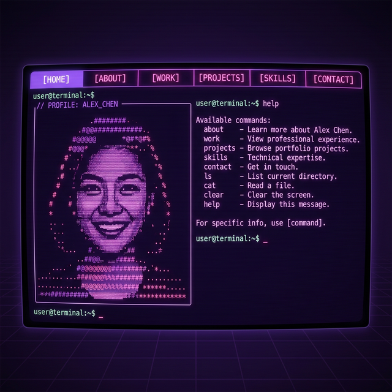

# ✧ Terminal Portfolio Site ✧

A premium, interactive personal portfolio that lives entirely inside an SSH session. Built with Node.js and the `blessed` library for a high-fidelity terminal user experience.



## ✮ Features

- **SSH Access**: Accessible from any terminal worldwide via `ssh`.
- **Mysterious Purple Aesthetic**: A custom, curated color palette designed for a sleek, modern-retro look.
- **Interactive Terminal**: A custom-built command-line interface with history, tab-completion, and custom commands.
- **ASCII Portrait**: Auto-converts images to high-quality ASCII art blocks.
- **Responsive Layout**: Adapts to terminal window resizing in real-time.

## 🚀 Quick Start

### 1. Installation

```bash
npm install
```

### 2. Generate Host Keys
The server needs an RSA key to identify itself. You can generate one automatically:

```bash
npm run keygen
```

### 3. Start the Server

```bash
npm start
```

Your terminal site is now live at `localhost:2222`!

### 4. Connect
Open a new terminal and run:

```bash
ssh -p 2222 localhost
```

## 🛠️ Configuration

Customize your name, bio, and links in `config/settings.js`. You can change:
- `name` & `handle`
- `bio` content
- `links` (GitHub, LinkedIn, Email)
- `work` & `projects` timeline
- `figletFont` (Choose from several built-in fonts)

## 📷 ASCII Converter

To convert your own photo to ASCII blocks:
```bash
node config/converter.js path/to/your/image.jpg
```
The output will be saved as a `.txt` file which you can use in the `assets/` folder.

> [!TIP]
> **Pro Tip**: Make sure to maximize your terminal window to see the full 110-character width detail in the portrait!

## 📜 License
Apache License 2.0
